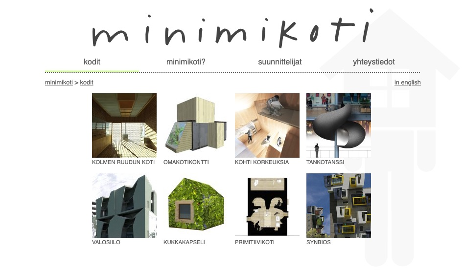

# minimikoti

Minimikoti website presents multiple minimal housing solutions developed by students at Tampere University of Technology in co-operation with [Finnish Housing Fair](https://www.asuntomessut.fi/).

## Installation

Install into a PHP7 environment. No database is needed.

## Licence

Source code is licensed under [GPLv3](LICENSE) and created by Akseli Palén under a contract with Finnish Housing Fair.

Copyrights of minimal houses, their images, and content are owned by the designers and are **not** part of the GPLv3 licensed material.
